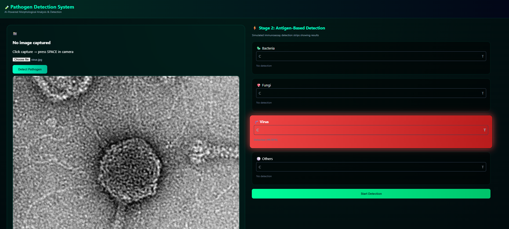
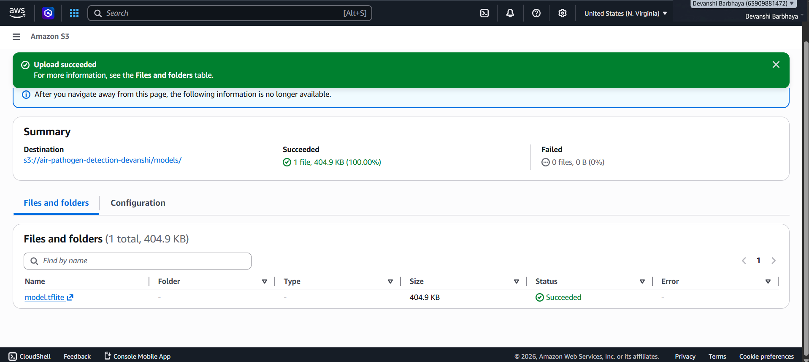
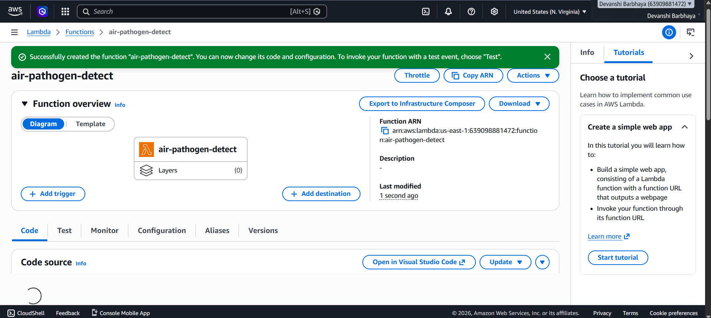
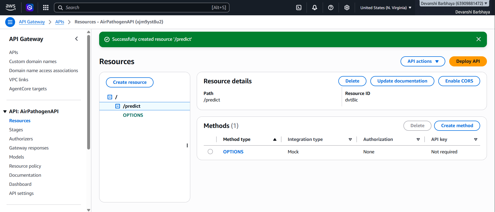
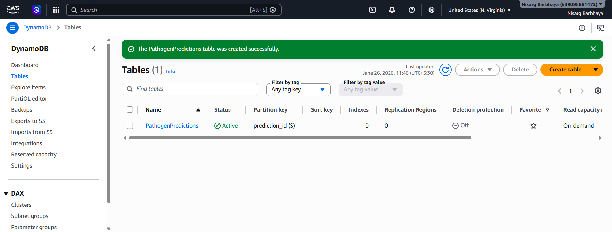

# 🧪 Air Pathogen Detection System
### AI-Powered Morphological Analysis | Deployed on AWS Serverless

&nbsp;&nbsp;

&nbsp;&nbsp;

&nbsp;&nbsp;

&nbsp;&nbsp;

---

## 🌐 Live Demo
> **[Click here to open the live detection system](http://air-pathogen-frontend-devanshi.s3-website-us-east-1.amazonaws.com)**

Upload any microscopy image → get instant AI classification

---

## 📌 What This Project Does

This system detects airborne pathogens from microscopy images using a trained Convolutional Neural Network (CNN). It classifies images into 3 categories:

| Pathogen | Description |
|----------|-------------|
| 🦠 Bacteria | Bacterial morphological patterns |
| 🍄 Fungi | Fungal spore and hyphal structures |
| 🧬 Virus | Viral particle indicators |
| ⚪ Others | Low confidence / unclassified |

---

## 🏗️ Architecture

User uploads image
        ↓
S3 Static Website (Frontend)
        ↓
API Gateway (REST API - POST /predict)
        ↓
AWS Lambda (Python 3.11 - 512MB)
        ↓
S3 Model Bucket (model.onnx download)
        ↓
ONNX Runtime Inference
        ↓
DynamoDB (log prediction)
        ↓
JSON Response → UI Updates

---

## 🛠️ Tech Stack

### Machine Learning
| Component | Technology |
|-----------|------------|
| Model Architecture | Sequential CNN (Keras) |
| Training Framework | TensorFlow / Keras |
| Inference Format | ONNX Runtime |
| Input Shape | 224 × 224 × 3 (RGB) |
| Output Classes | 3 (Bacteria, Fungi, Virus) |
| Model Accuracy | ~72-75% |
| Training Platform | Google Colab |

### AWS Services
| Service | Purpose |
|---------|---------|
| AWS Lambda | Serverless inference engine |
| Amazon S3 | Model storage + frontend hosting |
| API Gateway | REST API endpoint |
| DynamoDB | Prediction logging |
| CloudWatch | Monitoring and logging |
| IAM | Security and permissions |

### Frontend
| Component | Technology |
|-----------|------------|
| UI | HTML5 + CSS3 + JavaScript |
| Design | Dark theme with animated detection strips |
| Hosting | S3 Static Website |

---

## 📸 Screenshots

### Live Detection Working

### AWS Services

---

## 🚀 How to Use

1. Open the **[Live Demo](http://air-pathogen-frontend-devanshi.s3-website-us-east-1.amazonaws.com)** link
2. Click **Choose File** and upload a microscopy image
3. Click **Detect Pathogen**
4. Wait 5-10 seconds for AI analysis
5. See result: Bacteria / Fungi / Virus + confidence %
6. Detection strip glows with color-coded result

---

## 📁 Repository Structure

air-pathogen-detection-aws/

├── README.md

├── lambda/

│   └── lambda_function.py    # AWS Lambda inference code

├── frontend/

│   ├── index.html            # Main UI

│   ├── style.css             # Dark theme styling

│   └── script.js             # API calls and UI updates

└── screenshots/              # AWS deployment screenshots

---

## ⚙️ AWS Deployment Summary

| Component | Details |
|-----------|---------|
| Lambda Memory | 512 MB |
| Lambda Timeout | 30 seconds |
| Lambda Runtime | Python 3.11 |
| Model Format | ONNX (converted from Keras .h5) |
| API Type | REST API - Regional |
| S3 Region | us-east-1 (N. Virginia) |
| Monthly Cost | $0 (AWS Free Tier) |

---

## 🧠 Key Technical Decisions

**Why ONNX instead of TFLite?**
TFLite runtime requires GLIBC 2.27+ which is unavailable on Lambda's Linux environment. ONNX Runtime has pre-built manylinux wheels compatible with Lambda.

**Why Serverless (Lambda)?**
No server running 24/7. Lambda runs only when an image is submitted. Zero idle cost. Scales automatically with requests.

**Why S3 for model storage?**
Lambda has 250MB layer limit. Storing model in S3 and downloading to /tmp at runtime allows larger models and easy updates.

---

## 👩‍💻 About

**Devanshi Barbhaya**
B.Tech CSE (Cloud Computing) | Silver Oak University, Ahmedabad
🔗 [LinkedIn](https://linkedin.com/in/devanshibarbhaya-5b62a0297)

---

## 📄 License
MIT License — feel free to use and modify
